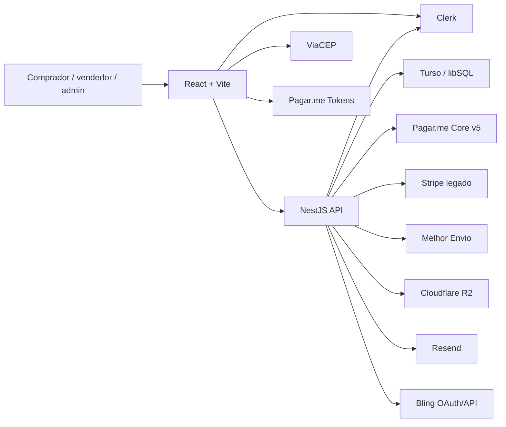

# Visão integrada

## O produto implementado

A Kolecta é um marketplace brasileiro de colecionáveis com quatro experiências principais:

- compra direta de anúncios;
- leilões, chamados no produto de **Modo Lance**;
- operação do vendedor, incluindo catálogo, pedidos, financeiro, mídia, integrações e onboarding de recebedor;
- comunidade, com posts, comentários, interações, ranking e moderação.

Há ainda áreas de conta do comprador, administração da plataforma e um programa de vendedores fundadores.

## Arquitetura em uma frase

Uma SPA React hospedável na Vercel consome uma API NestJS hospedável na Render; a API usa Clerk para identidade, Turso/libSQL com Drizzle para persistência e integra Pagar.me, Melhor Envio, Cloudflare R2, Resend e Bling, mantendo módulos Stripe como legado durante a migração.

## Fronteira entre os projetos

O frontend concentra:

- roteamento e proteção visual de páginas;
- formulários, validações de experiência e formatação;
- cache remoto via React Query;
- tokenização de cartão no navegador;
- carrinho, rascunho de anúncio e pequenos caches em `localStorage`;
- apresentação das áreas pública, comprador, vendedor e admin.

O backend é a fonte de verdade para:

- identidade interna e `role`;
- anúncios, moderação e publicação;
- estoque persistido, categorias e atributos;
- pedidos, totais, taxas, split e status financeiro;
- leilões, lances, pré-autorização e fechamento;
- carteira e saques;
- emissão de etiqueta;
- recebedores e KYC;
- disputas, mensagens, avaliações, comunidade e fundador.

O frontend nunca deve ser tratado como autoridade para preço, taxa, papel do usuário ou transição de status. O backend recalcula e valida esses dados.

## Identidade e autorização

1. O Clerk autentica o usuário no navegador.
2. O cliente envia o token Bearer à API.
3. O `AuthGuard` valida a sessão pelo Clerk.
4. O `RolesGuard` consulta a role atual no Turso; o banco, e não metadados do Clerk, é a fonte de verdade.
5. Em desenvolvimento, quando `NODE_ENV !== production`, o header `x-dev-user-id` permite selecionar um usuário de teste; o padrão é `seller-001`.

As roles existentes são `user` e `admin`. “Vendedor” não é uma role separada: é um usuário com perfil de vendedor e recursos associados.

## Fluxos principais

### Compra direta

1. O comprador adiciona um anúncio ao carrinho; hoje a quantidade fica limitada a uma unidade por anúncio.
2. No checkout, escolhe endereço salvo ou informa um novo.
3. Para envio, o frontend consulta frete e envia serviço/valor escolhido; retirada usa `deliveryMethod=pickup`.
4. O backend relê anúncios e preços, cria pedidos por vendedor e calcula comissão, frete e parte externa.
5. Pagamento de compra é PIX ou cartão. Desde 31/07, saldo da wallet não abate compras e não existe mais composição híbrida; o campo legado `useWalletBalance` ainda é aceito, mas é ignorado. Cartão é tokenizado no browser; número completo e CVV não passam pelo backend.
6. O webhook da Pagar.me confirma ou falha o pagamento.
7. Ao pagar, eventos internos atualizam pedido, integração Bling, e-mail e emissão de etiqueta.
8. O vendedor envia; entrega confirmada ou prazo automático libera o saldo.

### Modo Lance

1. Um anúncio `auction` nasce com registro de leilão, mas o relógio só começa quando a moderação ativa o anúncio.
2. O participante precisa estar autenticado e ter cartão salvo/tokenizado.
3. Cada lance cria uma pré-autorização Pagar.me com split obrigatório; ao ser superado, a autorização anterior é liberada.
4. Anti-sniper pode estender o término.
5. Cron encerra leilões expirados e tenta capturar a pré-autorização vencedora.
6. Se a captura falhar, nasce um pedido `pending_payment` com prazo para pagamento.
7. Outro cron expira pendências e processa a regra de continuidade.
8. A cada ciclo, pré-autorizações próximas do vencimento são reautorizadas; as demais são consultadas na Pagar.me e também são renovadas se a retenção já tiver desaparecido.
9. Leilões pausados durante indisponibilidade do recebedor voltam automaticamente, preservando o tempo restante, quando o webhook confirma que o vendedor está apto.

### Publicação de anúncio

1. O vendedor cria rascunho direto ou leilão.
2. O backend persiste metadados gerais, atributos flexíveis, SKU, estoque, fotos e dimensões.
3. `publish` aplica regras de completude e envia à moderação.
4. Admin aprova ou reprova, registrando auditoria e motivo.
5. A moderação emite `listing.moderated`, que alimenta notificações.
6. Anúncio ativo aparece no catálogo; fundador pode consumir crédito para destacá-lo por sete dias.
7. Vendido, o pagamento confirmado baixa uma unidade do estoque. Sobrando estoque o anúncio segue ativo; zerando, volta a `paused`, de onde o vendedor repõe e reativa sem nova moderação. Anúncio sem estoque informado vai direto a `sold`.

### Frete

1. Cotação usa Melhor Envio e resolve origem pelo request, endereço do vendedor ou fallback configurado. Por padrão, filtra a resposta para seis serviços permitidos.
2. Se token/origem estiver ausente em desenvolvimento, o serviço pode retornar mock.
3. Após pagamento, listener tenta emitir etiqueta automaticamente.
4. O carrinho do Melhor Envio é persistido para idempotência.
5. Status vai de `pending` a `ready`, ou `failed` com erro visível.
6. Vendedor autenticado pode tentar novamente ou baixar o PDF. O e-mail anexa a etiqueta quando disponível e aponta para o pedido da Kolecta, nunca para uma sessão protegida do Melhor Envio.

### Recebedor, split e saque

1. O vendedor faz onboarding Pagar.me como pessoa física ou jurídica.
2. Estado e permissões (`canReceive`, `canWithdraw`) ficam no perfil.
3. Link de KYC/prova de vida é obtido sob demanda.
4. Webhook atualiza status e dispara avisos de aprovação ou ação necessária.
5. Checkout e leilão exigem recebedor ativo do vendedor e `PAGARME_PLATFORM_RECIPIENT_ID`; a operação falha antes da cobrança quando o split não pode ser montado.
6. Saque cria uma transferência Pagar.me e acompanha o estado por webhook.
7. Campos e módulos Stripe ainda coexistem como legado, não como fluxo preferencial.

A wallet continua sendo o espelho de saldo, retenção, depósito e saque. Ela não
é mais instrumento de compra. As telas e endpoints de depósito ainda existem;
essa divergência é um risco crítico descrito em
[Estado, riscos e divergências](./07-estado-riscos.md).

### Comunidade

1. Feed público lista posts ativos com filtros e paginação.
2. Usuário autenticado cria/edita/remove posts, comenta e alterna like/save/pin.
3. Contadores são denormalizados.
4. Cron a cada 15 minutos recalcula score.
5. Denúncias entram em fila admin; admin pode ocultar, remover, restaurar, banir e desbanir.

### Programa fundador

- números são permanentes e únicos;
- códigos de convite cobrem uma faixa reservada;
- vendedor elegível pode passar por `pending`, `active` e `lapsed`;
- o benefício inclui comissão diferenciada e créditos de destaque;
- cron diário aplica a regra de manutenção;
- admin possui fila de candidatos e concessão manual.

## Pontos centrais segundo o Graphify

No backend, os nós mais conectados são:

- `src/database/schema.ts`;
- `src/app.module.ts`;
- `src/database/database.module.ts`;
- `OrdersService`, `AuctionsService`, `ListingsService`, `FounderService`;
- `AuthGuard` e `RolesGuard`.

No frontend:

- `src/hooks/use-api.ts`;
- `src/lib/api.ts`;
- `src/App.tsx`;
- `src/lib/utils.ts`;
- páginas de criação de anúncio, financeiro, checkout, detalhes de produto, leilão e disputas.

Na prática, alterações de contrato devem começar por `schema/DTO/controller/service` no backend e terminar em `api.ts/use-api.ts/página` no frontend. Esses arquivos formam o eixo de acoplamento do sistema.
