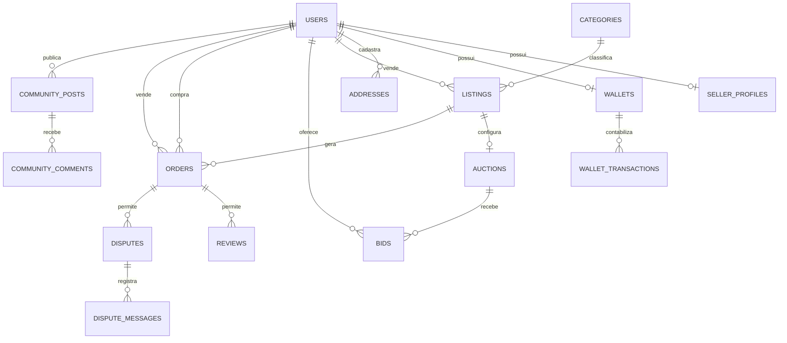

# Modelo de dados

## Visão geral

O schema Drizzle define 31 tabelas em `src/database/schema.ts`. IDs de domínio são `text`, normalmente UUIDs, com exceção do usuário, cujo ID espelha o Clerk. Valores financeiros usam centavos inteiros. A maioria das tabelas usa `createdAt` e `updatedAt`.



## Identidade e vendedor

### `users`

Identidade interna espelhada do Clerk.

Campos relevantes:

- `id`, `email`, `name`;
- `role`: `user|admin`;
- `cpf`, `phone`;
- `avatarUrl`: foto copiada do Clerk pelo webhook `user.created`/`user.updated`. É o fallback do avatar do vendedor quando não há foto de loja em `seller_profiles.avatar_url`. Fica `null` quando o Clerk reporta `has_image: false`, porque nesse caso a `image_url` dele é um avatar gerado com as iniciais e o frontend já desenha isso sozinho;
- `pagarmeCustomerId`;
- `termsVersion`, `termsAcceptedAt`, `lgpdAcceptedAt`;
- timestamps.

CPF e telefone são dados pessoais. Não devem aparecer integralmente em logs ou respostas administrativas desnecessárias.

### `seller_profiles`

Extensão 1:1 lógica de usuário vendedor.

Grupos de campos:

- legado Stripe: `stripeAccountId`, onboarding, charges/payouts;
- verificação da Kolecta: `isVerified`;
- Pagar.me/KYC: recipient ID, tipo, documento, nome legal, status, permissões e data;
- fundador: número, status, data, última atividade;
- loja: nome, avatar, bio, localização, site e categorias;
- políticas: envio, devolução, pagamento, ofertas e desconto;
- preferências de notificação em JSON.

`founderNumber` possui índice único. `userId` tem índice não único (`seller_profiles_user_idx`), porque toda linha da vitrine faz join com esta tabela; o índice não impõe a relação 1:1, que continua sendo responsabilidade do service.

### `founder_invite_codes`

Códigos de convite com número fundador reservado, usuário e instante do resgate. `code` e `founderNumber` são únicos.

### `founder_credits`

Carteira 1:1 de créditos de destaque:

- total;
- usados;
- expiração.

`userId` é único.

## Catálogo e leilão

### `categories`

Árvore simples:

- nome;
- slug único;
- ícone;
- `parentId` opcional.

`parentId` é textual e não declara foreign key no schema.

### `listings`

Agregado de anúncio:

- vendedor e categoria;
- título/descrição;
- marca, linha, escala, ano, edição;
- atributos JSON;
- condição;
- tipo `direct|auction`;
- preço em centavos;
- fotos em JSON;
- SKU e estoque;
- status;
- motivo e auditoria de moderação;
- peso e dimensões;
- destaque e origem;
- timestamps.

Relações:

- `sellerId -> users`;
- `categoryId -> categories`;
- `moderatedBy -> users`.

Status encontrados no código:

```text
draft -> pending_review -> active -> sold
                \-> rejected/cancelled
active <-> paused por ação operacional do listing/leilão
active -> paused quando a venda zera o estoque
active -> pending_payment em situações transacionais específicas
```

O vocabulário não está restrito por enum no banco. Services e frontend precisam permanecer alinhados.

`stock` é a quantidade em estoque; `null` significa "não informado" e é tratado
como unidade única. A baixa acontece na confirmação do pagamento, dentro do
banco (`stock = stock - 1 WHERE stock > 0`), para que duas compras simultâneas
da última unidade não levem o valor a negativo. Ao chegar a zero o anúncio vai
para `paused`, e não `sold`, porque de `paused` o vendedor reativa direto por
`POST /api/listings/:id/publish`, sem passar de novo pela moderação.

Índices:

| Índice | Colunas | Serve a |
|---|---|---|
| `listings_status_created_idx` | `status`, `created_at` | vitrine e ordenação padrão |
| `listings_status_category_idx` | `status`, `category_id` | página de categoria |
| `listings_seller_idx` | `seller_id` | perfil da loja, "meus anúncios", contagem de qualificação do fundador |

### `auctions`

Configuração 1:1 lógica do listing:

- lance inicial, incremento e reserva;
- lance atual e vencedor;
- duração e término;
- pausa e tempo restante;
- anti-sniper;
- status `active|ended|cancelled`.

`listingId` referencia listing e tem índice não único (`auctions_listing_idx`), usado pelo join da vitrine; a duplicidade continua sendo impedida pelo service, não pelo banco.

### `bids`

Histórico de lances:

- leilão, participante e valor;
- status `active|outbid|won|lost|released`;
- IDs de order/charge/card Pagar.me;
- expiração da pré-autorização;
- data.

O registro contém apenas referência tokenizada do cartão. `auctionId` tem índice
(`bids_auction_idx`), usado pela contagem de lances que a vitrine faz por
subconsulta e pelo histórico da tela do leilão.

## Endereço, pedido e pós-venda

### `addresses`

Agenda do usuário:

- rótulo;
- destinatário;
- endereço completo;
- país;
- flag padrão.

Não há restrição de banco garantindo um único endereço padrão; o service faz a normalização.

### `orders`

Registro central da transação:

- comprador, vendedor, anúncio e endereço;
- total e frete;
- método de entrega;
- referências Stripe/Pagar.me;
- status e prazo de arremate;
- tracking;
- serviço/carrinho/PDF/status/erro da etiqueta;
- líquido do vendedor e taxas;
- composição wallet/externa;
- instrumento e parcelas;
- juros;
- marcos de entrega, confirmação, liberação e conclusão.

Estados principais observados:

```text
pending -> paid -> shipped -> delivered -> completed
    |         |                         \-> confirmação/liberação
    \-> cancelled

pending_payment -> paid
       \-> cancelled/expirado

paid/shipped -> disputed
qualquer fluxo elegível -> refunded/chargeback conforme integração
```

Como a coluna é texto sem enum, o service é a autoridade das transições.

### `favorites`

Usuário + anúncio + data. Não há unique index no par; o service precisa garantir idempotência.

### `saved_cards`

Um cartão tokenizado por usuário:

- `pagarmeCardId`;
- bandeira e últimos quatro;
- titular;
- mês/ano.

Índice único em `userId`.

### `conversations`

Anúncio, comprador e vendedor. Não há unique index composto; o service localiza conversa existente antes de criar.

### `messages`

Conversa, remetente, conteúdo, leitura e criação.

### `reviews`

Pedido, autor, alvo, nota e comentário. O banco não impõe faixa da nota nem unicidade; DTO/service impõem regras.

### `disputes`

Pedido, denunciante, motivo, descrição, status, resolução e data de resolução.

### `dispute_messages`

Timeline da disputa:

- remetente opcional;
- `type=message|system`;
- conteúdo;
- timestamps.

## Financeiro

### `wallets`

Uma carteira por usuário:

- `balanceInCents`: disponível;
- `pendingInCents`: retido;
- `withdrawalPendingInCents`: saque em processamento.

`userId` é único.

### `wallet_transactions`

Ledger:

- carteira;
- tipo;
- valor positivo;
- status;
- referências de pedido, leilão e lance;
- evento Stripe legado;
- descrição;
- timestamps.

Os services usam tipos além do comentário original (`credit`, `debit`, `hold`), incluindo o ciclo específico de lances. Consumidores devem tratar `type` como vocabulário extensível.

### `webhook_events`

Idempotência e auditoria:

- `stripeEventId` único;
- `providerEventId` único;
- tipo;
- status `pending|processed|failed`;
- erro.

Durante a migração, eventos Pagar.me ainda podem usar o campo de nome Stripe.

### `withdrawal_requests`

Solicitação de saque:

- usuário e valor;
- status `requested|processing|paid|failed|cancelled`;
- IDs Stripe legados;
- IDs transfer/recipient Pagar.me;
- motivo de falha.

## Integração e importação

### `bling_connections`

Uma conexão OAuth por usuário:

- access token;
- refresh token;
- expiração em timestamp Unix de segundos.

Tokens são segredos persistidos. O schema não indica criptografia em repouso pela aplicação.

### `import_jobs`

Job de importação:

- usuário;
- estado `processing|completed|failed|completed_with_errors`;
- totais processados/falhos;
- erros em JSON;
- timestamps.

Os dados do arquivo não são persistidos na tabela; apenas progresso e erros.

## Comunidade

### `community_posts`

Post:

- autor;
- tipo `collection|product|discussion|guide`;
- título, corpo, imagens;
- categoria/anúncio opcionais;
- status `active|hidden|removed`;
- contadores de like/save/comment/pin;
- score e data de recálculo;
- timestamps.

### `community_comments`

Post, autor, corpo, status e timestamps.

### `community_post_likes`

Interação com índice único `(postId, userId)`.

### `community_post_saves`

Interação com índice único `(postId, userId)`.

### `community_pins`

Interação com índice único `(postId, userId)`.

### `community_reports`

Denúncia:

- alvo `post|comment`;
- ID do alvo;
- autor;
- motivo/descrição;
- status `open|reviewed|dismissed`;
- resolução.

`targetId` não é foreign key porque pode apontar a duas tabelas.

### `community_bans`

Um ban ativo por usuário:

- motivo;
- admin responsável;
- timestamps.

`userId` é único.

## Notificações

### `email_log`

Auditoria/idempotência de e-mail:

- template;
- destinatário;
- referência de domínio;
- ID do provedor;
- status `sent|failed|skipped`;
- erro;
- timestamps.

Índice único em `(template, refId, recipient)`.

## Integridade: o que o banco garante e o que fica no service

Garantias explícitas relevantes:

- e-mail, slug de categoria e IDs de evento únicos;
- uma wallet, cartão, conexão Bling, ban e carteira de créditos por usuário;
- um like/save/pin por usuário e post;
- número fundador único;
- idempotência de e-mail por template/referência/destinatário.

Garantias apenas de aplicação:

- um seller profile por usuário;
- um leilão por listing;
- um favorito por usuário/listing;
- uma conversa por listing/comprador/vendedor;
- uma avaliação permitida por papel/pedido;
- transições válidas de status;
- um endereço padrão;
- consistência dos contadores da comunidade.

Esses pontos são candidatos a índices/restrições futuras, desde que uma auditoria de duplicados seja feita antes.

